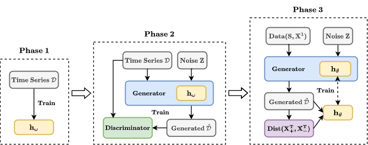

# Long-term Fair Decision Making Through Deep Generative Models

This is the Pytorch implementation of Long-term Fair Decision Making Through Deep Generative Models. This paper proposes a 3-phase framework to achieve long-term fairness, which is illustrated in the following.



## Requirements
#### System requirements
The following environment was used to conduct our experiments.

+ Ubuntu 18.04
+ CUDA 11.7
+ Python 3.9.7

#### Python environment
To install package requirements:
```
pip install -r requirements.txt
```

## Run the experiments
We have placed my experimental codes in the directory `experiments`.
Just run the file `SimLoan-DeepLF.ipynb` and `Taiwan-DeepLF.ipynb`.